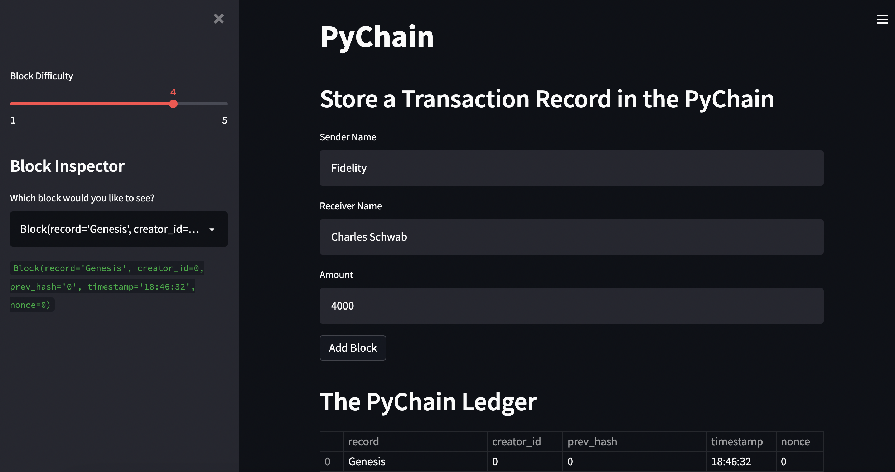
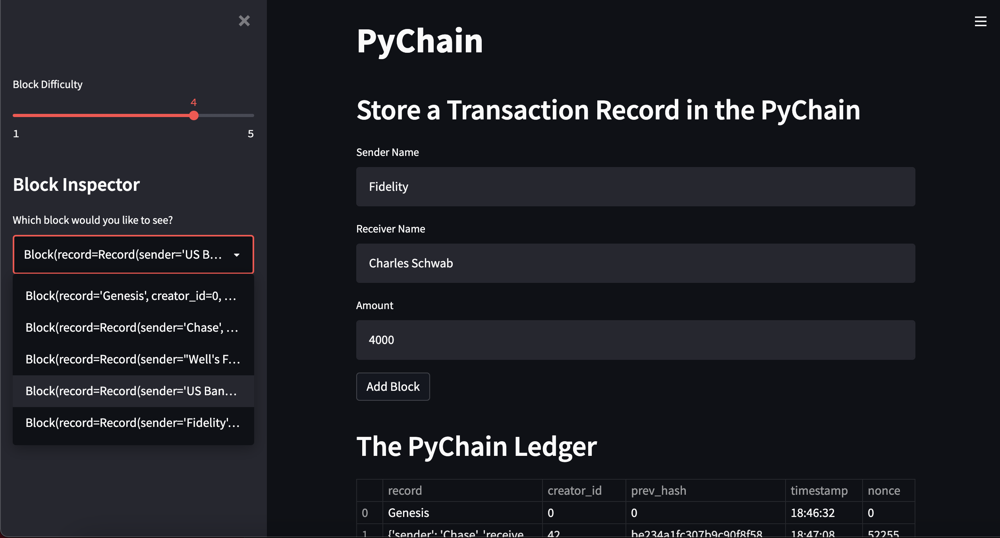
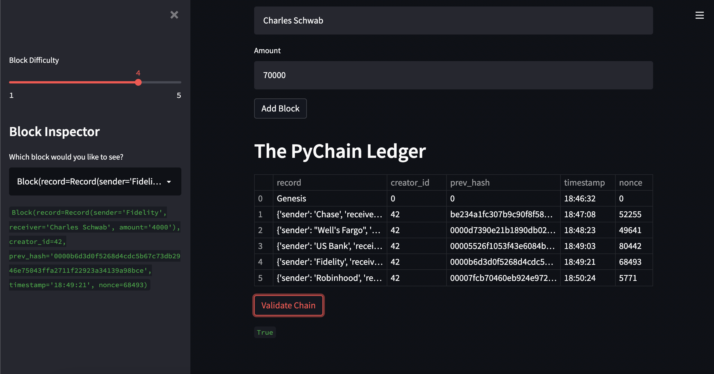

# PyChain Ledger


The goal of this file is to build a blockchain-based ledger system that allows partner banks to conduct financial transactions and to verify the integrity of the data in the ledger. This file will also create a user-friendly web interface where users can add a block to the chain that includes sender, receiver, and amount information. Users can validate the chain, inspect any of the blocks, and adjust the block difficulty. 

---

## Technologies 
In addition to the standard Python 3.9 libraries, this file uses the following libraries and/or dependencies:
* [streamlit](https://streamlit.io/) - turns data scripts into shareable web apps using python
* [dataclasses](https://docs.python.org/3/library/dataclasses.html) - a decorator that is used to add generated special methods to classes
* [typing](https://docs.python.org/3/library/typing.html) - provides runtime support for type hints
* [datetime](https://docs.python.org/3/library/datetime.html) - supplies classes for manipulating dates and times
* [pandas](https://pandas.pydata.org/) - open source data analysis and manipulation tool, built on top of the Python programming language
* [hashlib](https://docs.python.org/3/library/hashlib.html) - implements a common interface to many different secure hash and message digest algorithms

---

## Installation Guide
If you do not already have streamlit installed, install it using this code in the terminal:
`pip install streamlit`

Verify the installation:
`streamlit --version`

---

## Usage
To interact with this file and open your own streamlit web interface using the code in `pychain.py`:
1. Fork the repository
2. Clone the forked repository to your local machine `git clone <repo_name>`
3. Open your terminal and change your current working directory to the location where `pychain.py` is stored
4. Activate the environment and launch streamlit:
    ```
    conda activate dev
    streamlit run pychain.py
    ```

Instructions for using the streamlit application:
1. Enter values for the sender, receiver, and amount. Then click the "Add Block" button. Do this several times to store several blocks in the ledger. (You can also adjust the block difficulty if you would like. This indicates how many zeros must be at the beginning of the block hash.)
2. Verify the block contents and hashes in the streamlit drop-down menu.
3. Test the blockchain validation process by clicking on the "Validate Chain" button.

---

## Methods
1. Create a data class named "Record" - include sender, receiver, and amount attributes
2. Create a data class named "Block" - create and hash the blocks
3. Create a data class named "PyChain" - chain the blocks together and create methods for proof of work and validating the blockchain
4. Add the cache decorator for streamlit
5. Add relevant user inputs to the streamlit interface 
6. Test the PyChain Ledger by storing records on the streamlit application and testing the blockchain validation process

---

## Results - Streamlit Application
For examples of the streamlit application in action, check out these screenshots. There is also a video example in the "Images_Video" folder.

### App Overview 



### Block Difficulty and Block Inspector Features 


### Added Blocks and Validated Chain


---

## Contributors
Catherine Croft

Email: catherinecroft1014@gmail.com

LinkedIn: [catherine-croft](https://www.linkedin.com/in/catherine-croft-4715481aa/)

---

## License 
MIT